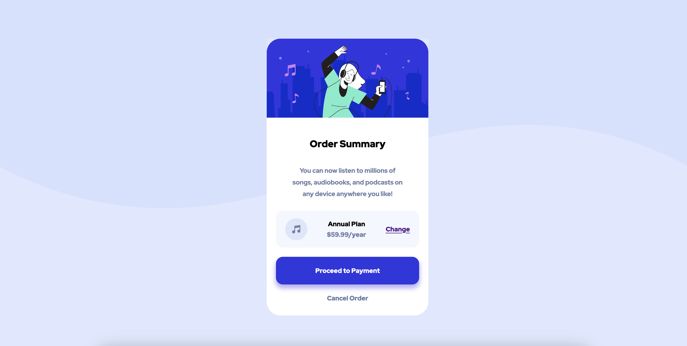

# Frontend Mentor - Order summary card

his is a solution to the [Order summary card challenge on Frontend Mentor](https://www.frontendmentor.io/challenges/order-summary-component-QlPmajDUj). Frontend Mentor challenges help you improve your coding skills by building realistic projects. 

## Table of contents

- [Overview](#overview)
  - [Screenshot](#screenshot)
  - [Links](#links)
- [My process](#my-process)
  - [Built with](#built-with)
  - [What I learned](#what-i-learned)
  - [Continued development](#continued-development)
  - [Useful resources](#useful-resources)
- [Author](#author)
- [Acknowledgments](#acknowledgments)

## Overview
### Screenshot


### Links

- Solution URL: [Add solution URL here](https://your-solution-url.com)
- Live Site URL: [Add live site URL here](https://your-live-site-url.com)

## My process

### Built with

- Semantic HTML5 markup
- CSS custom properties
- Flexbox
- CSS Grid
- 

### What i learned

I use box-shadow for the first time in button .
```
 box-shadow: 0 .4rem .5rem .09rem var(--bright-blue-shadow)
```
learn also how to use line-weight.
```
line-height: 0.5rem;
```
I use grid and flexbox in the same time.
```
 display: grid;
    place-content: center;
    width: 100%;
    min-height: 100vh;
```
I create some ariable in css who i use it in differente class 
```
:root{
    --pale-blue:hsl(225, 100%, 94%);
    --bright-blue:hsl(245, 75%, 52%);
    --neu-plae-blue:hsl(225, 100%, 98%);
    --neu-dest-blue:hsl(224, 23%, 55%);
    --neu-dark-blue: hsl(223, 47%, 23%);
    --bright-blue-shadow:rgba(56, 41, 224, 35%);

    
}
```

### Continued development
Yes i wanna continue to practise some of the skills i learn today and maybe i can overide them to have something better.

### Useful resources
-[3wschool](https://www.w3schools.com/).
this link help me to understand how the css grid work?
how we can use them for making your website great

## Author

- Frontend Mentor - [@B-batman12thy](https://www.frontendmentor.io/profile/B-batman12thy)
- Twitter - [@djibythioub](https://twitter.com/djibythioub)